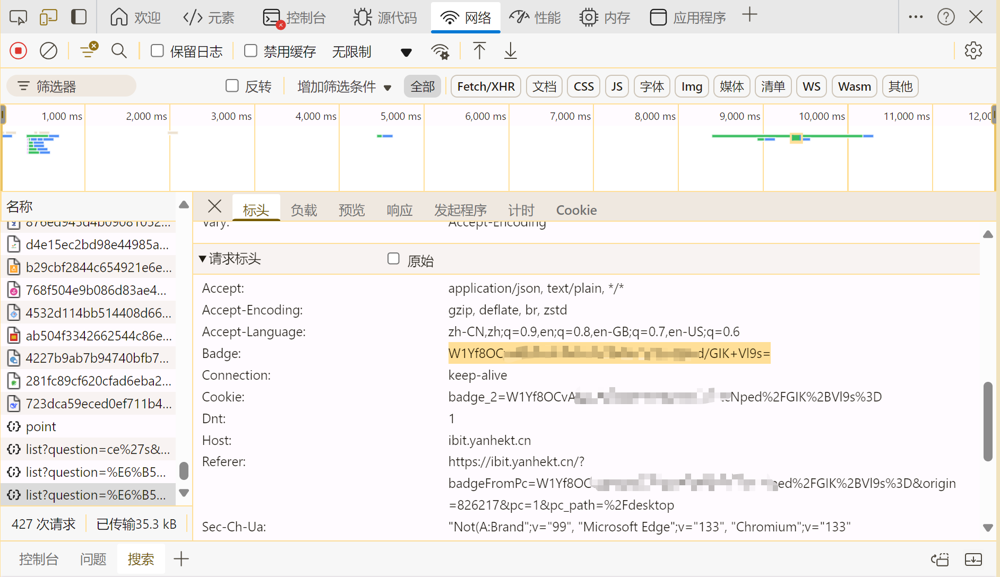

# BIT_Deepseek请求脚本使用说明
北理工版本DeepSeek采用32B模型，此脚本用于向 API 发起 POST 请求，并动态从 `config.yaml` 文件中加载 `badge` 值。请求头中的 `badge` 和 `cookie` 值会根据 `badge` 的内容进行适当格式化。请求格式中包含了payload参数内容，用户可以自行调整。

## 环境要求

- Python 3.x
- 安装 `requests` 和 `PyYAML` 库

可以通过以下命令安装所需库：

```bash
pip install requests pyyaml
```

## 配置文件

在脚本运行之前，确保配置文件 `config.yaml` 存在，并包含以下内容：

```yaml
badge: "W1Yf8OCvAt******************1dvbLQjiTdQSQ4="
```

- `badge` 的值是你的 API 密钥，脚本会从这个文件中加载并使用它。


## badge获取

badge密钥实际上就是延河课堂的cookies，在浏览器中打开开发者模式，使用F12打开网络选项，随意向艾比特提出一个问题，在响应中寻找cookies的条目。




## 脚本说明

该脚本会从 `config.yaml` 文件中读取 `badge` 值，并进行以下操作：

1. **更新请求头**：将 `badge` 值填充到请求头的 `badge` 字段中。
2. **更新 cookie**：根据 `badge` 值更新 `cookie` 中的 `badge_2` 字段（去掉 `=`，并替换为 `%3D`）。
3. **发起请求**：脚本会向指定的 API 发起一个 POST 请求，并使用流式响应处理返回的数据。

## 使用方法

1. 将 `config.yaml` 文件与脚本放在同一目录下。
2. 运行脚本：

```bash
python app.py
```

脚本将自动加载配置文件中的 `badge` 值并执行相应的 API 请求。

## 示例输出

当请求成功时，脚本会实时打印从 API 返回的答案。以下是一个示例：

```
今天天气非常好，适合外出活动！
```

## 错误处理

- 如果找不到 `config.yaml` 文件，脚本将终止并输出错误信息。
- 如果 `badge` 值无效或格式错误，脚本也会给出提示并退出。

## 常见问题

- **Q: `config.yaml` 文件放在哪里？**
  - `config.yaml` 应与脚本文件放在同一目录下。如果需要放置在其他目录，请根据路径修改脚本中的文件读取部分。
  
- **Q: 如何更新 `badge` 值？**
  - 只需编辑 `config.yaml` 文件中的 `badge` 值即可。
